# Project 2 - Design Journey

**For each milestone, complete only the sections that are labeled with that milestone.**

Be clear and concise in your writing. Bullets points are acceptable.

## Milestone 1

### Target Audience (Milestone 1)

My target audience is members of the Ithaca community and surrounding the surrounding towns. These are most likely to be families with children looking to have some fun and enjoy their weekend.

### Persona (Milestone 1)

Kristen is a mother of three who lives in Ithaca, New York. She works as in a bank as an analyst. Her children range from ages 8 to 15, and she is married to an engineer. One of her children is allergic to dairy. Kristen loves spending time with her family doing cute, wholesome activities. She enjoys taking pictures of said wholesome activities and putting them on her facebook. She also has a golden retriever.

### Needs (Milestone 1)

- Need/Want #1
  - **Needs and Wants**
    - A list of things to do and see at the Apple Harvest Festival
  - **Design Ideas and Choices**
    - A page with the schedule of performances and entertainment
    - Clearly laid out in a table with times and locations
  - **Memo**
    - Kristen will be able to pick and choose which performances she and her family would want to see, and can fit her schedule around the information presented in this page
- Need/Want #2
  - **Needs and Wants**
    - A list of available food to make sure her child with allergies will have things to eat and will stay safe.
  - **Design Ideas and Choices**
    - A page with all the foods that will be there laid out in a grid
    - Each picture of food will link to nutrition information and allergens
  - **Memo**
    - Kristen will be able to plan accordingly and can pack food if necessary

### Sketches / Screenshots / Storyboards (Milestone 1)
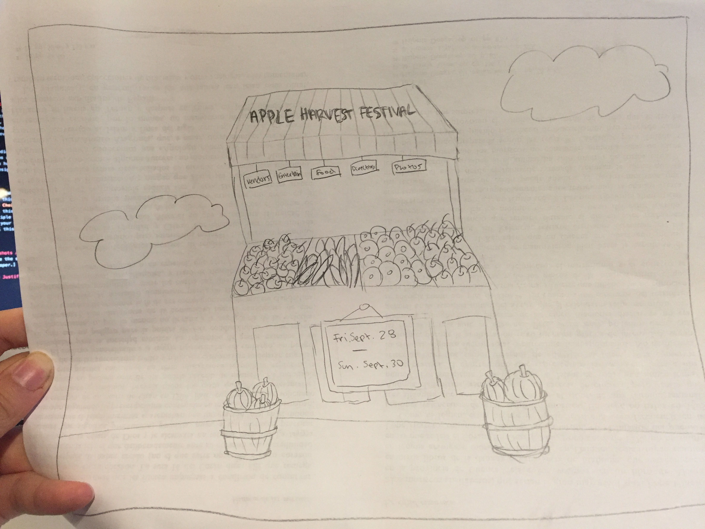
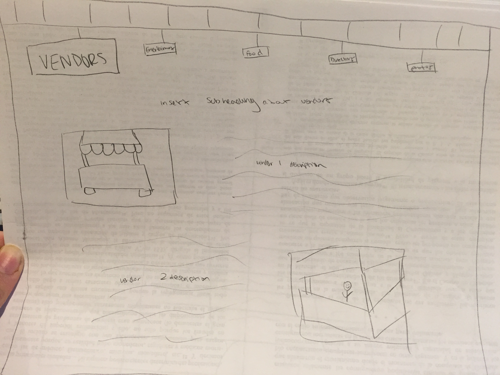
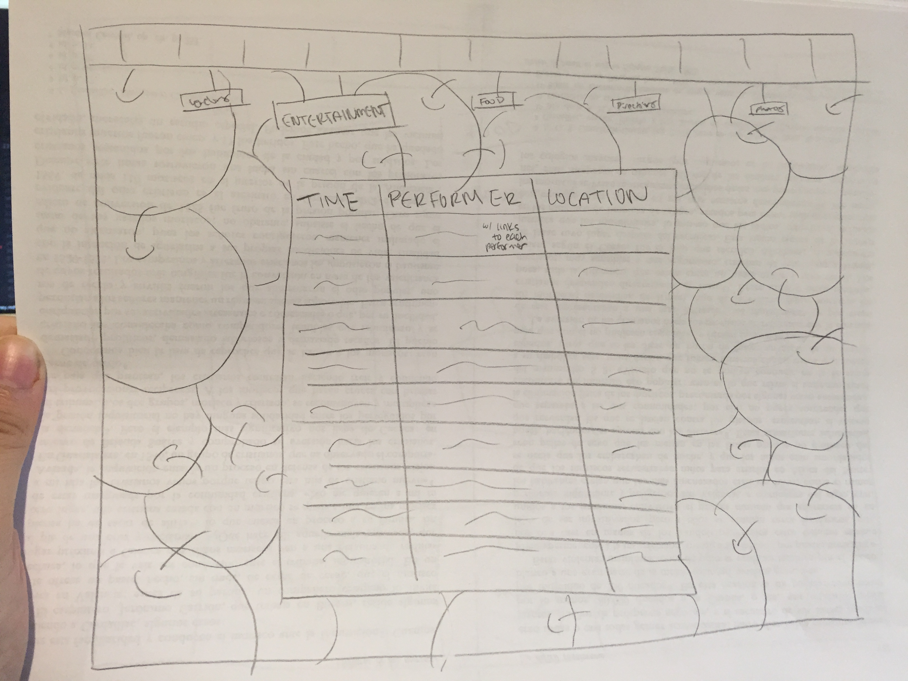
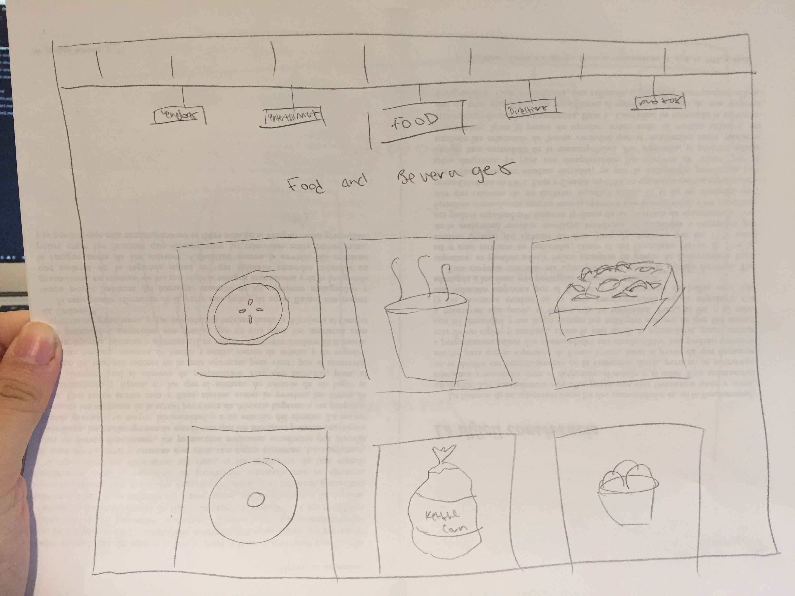
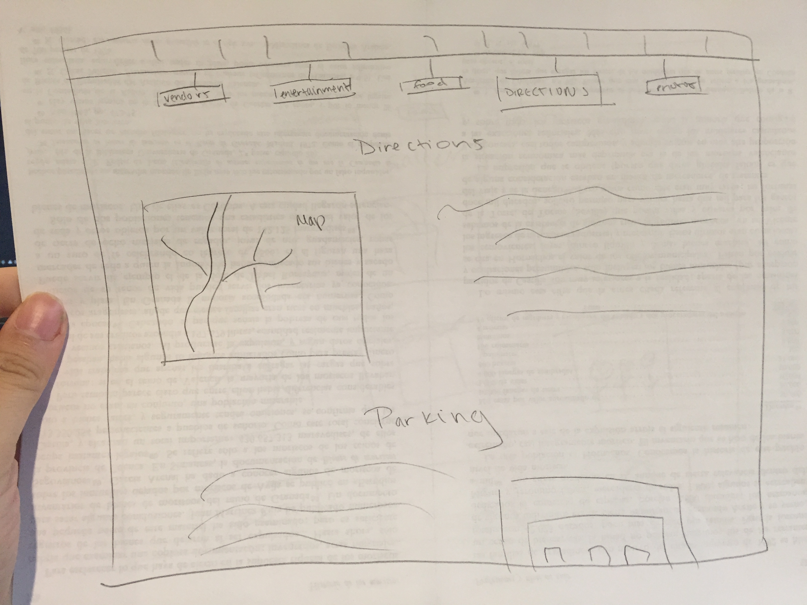
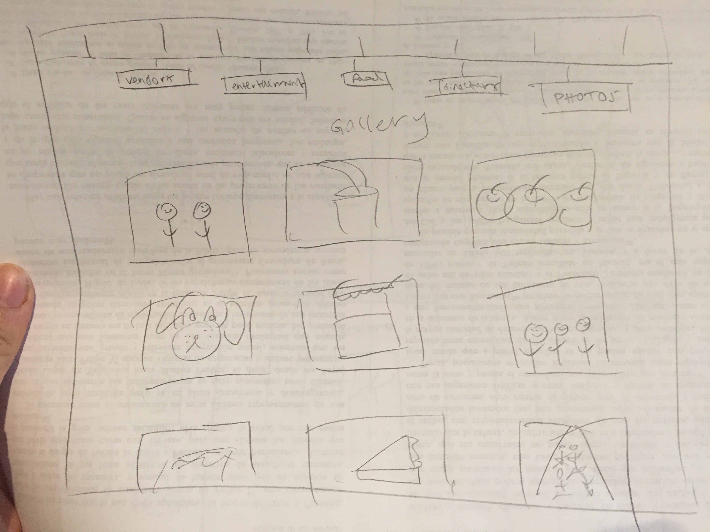
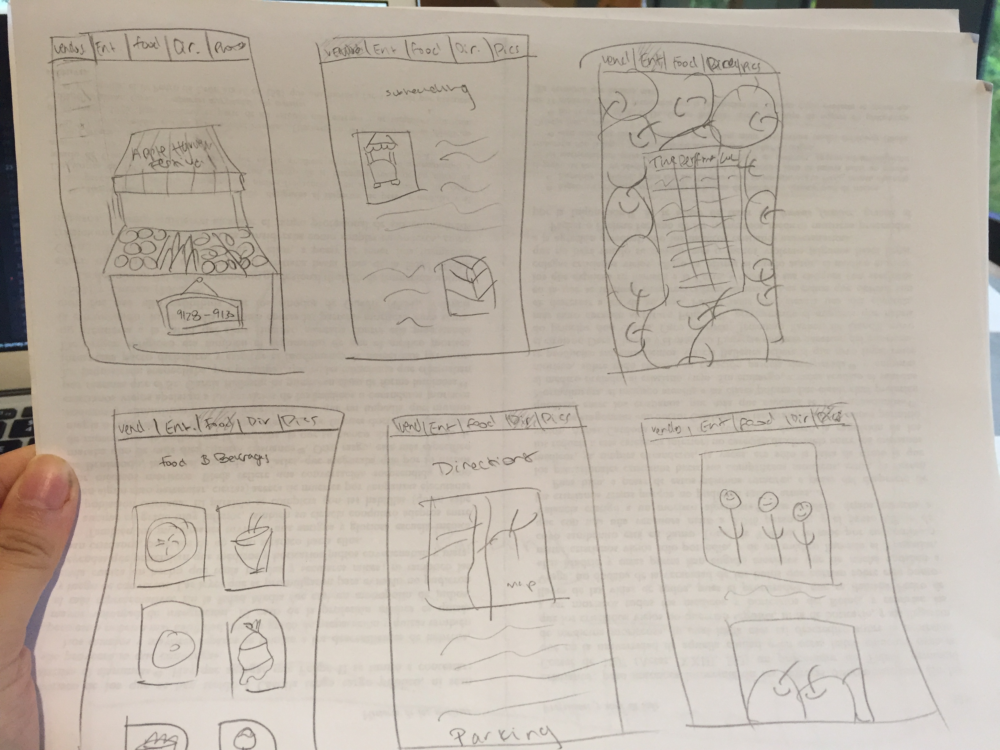

### Additional Design Justifications (Milestone 1)

---

## Milestone 2

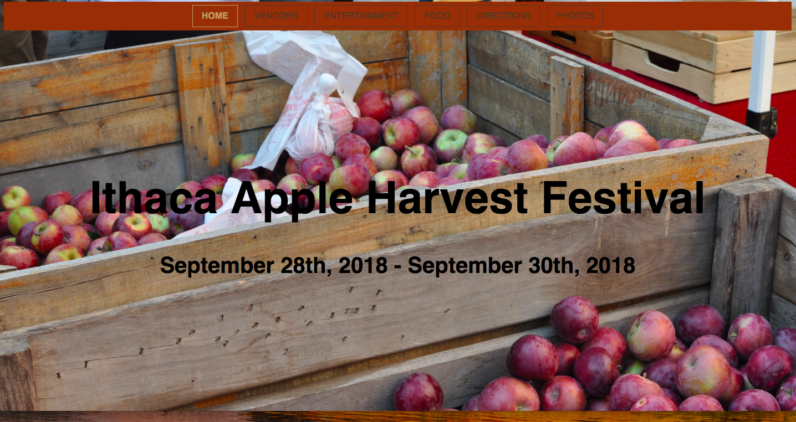
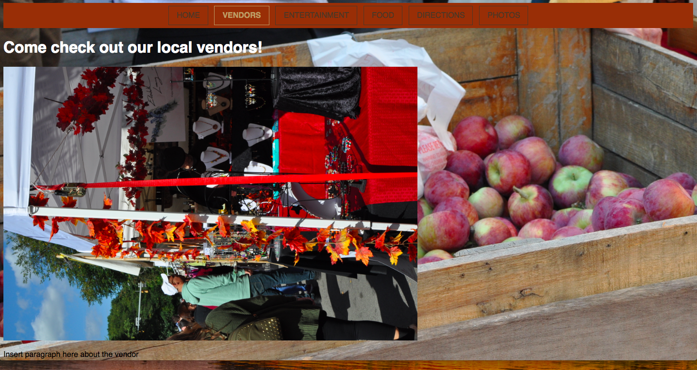
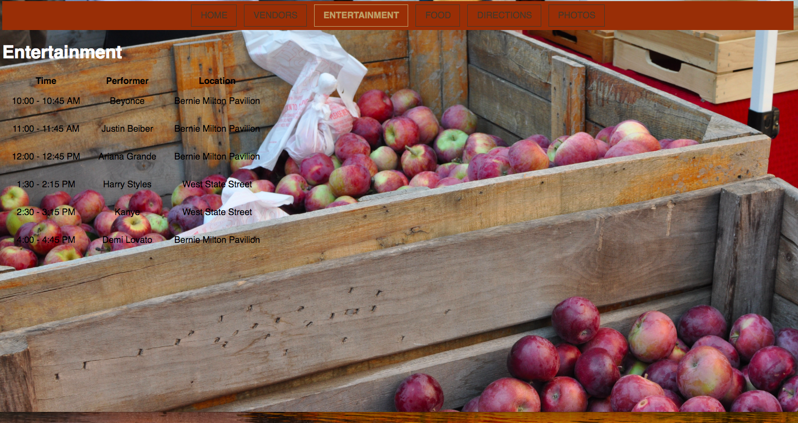
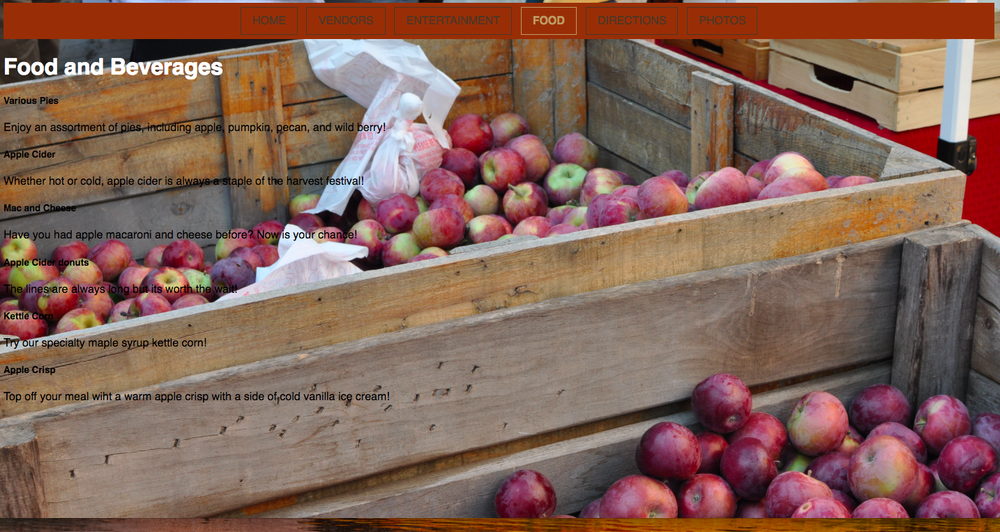
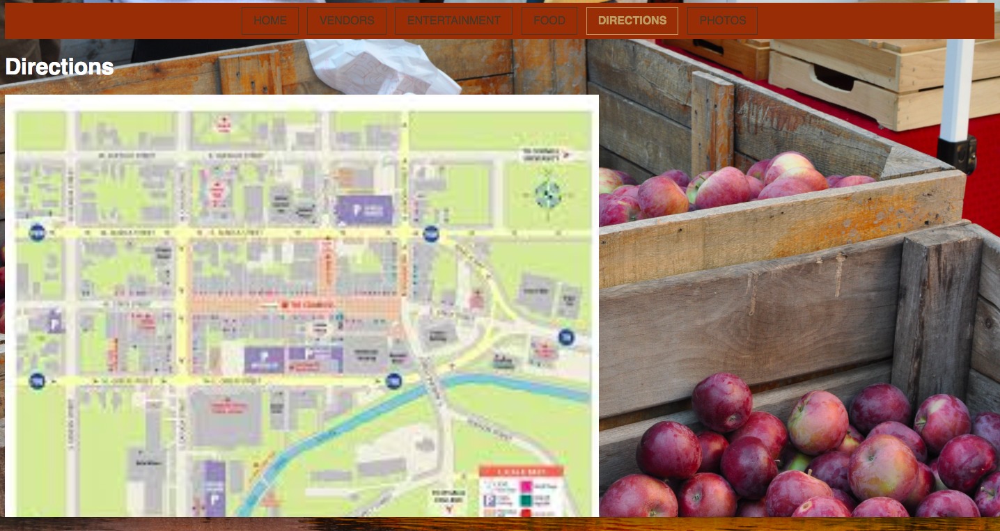
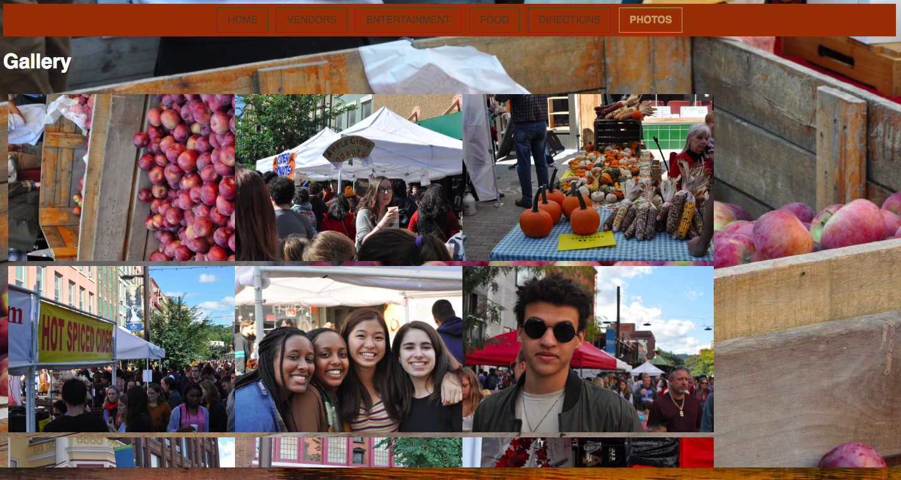

### Task Planning (Milestone 2)
[Plan out your four tasks for Milestone 2 here before doing your user testing]

1. You are looking to attend the Apple Harvest Festival around 11am. Who will be performing then?

2. Your favorite desert is apple crisp and would like to know if you can eat it at the apple festival. Will there be apple crisp?

3. Where can you find parking?

4. You are looking for some room decorations. Will there be cute decorations?

### User 1 (Milestone 2)
[In this part, describe your user 1 by answering the questions below.]

1. User 1 is Sophia Zhang, a sophomore CALS student on a pre-med track. She is 19 years old and loves photography outings. She likes things to be aesthetic and is artistic. She is from New York City and is fascinated by the small town life of Ithaca New York.

2. Yes, as a member of the Ithaca community, Sophia is a member of my target audience.

### Tasks for User 1 (Milestone 2)
[Report the results for your user's performance on each of your four tasks. You should **describe the task** you ask the user to complete, explain **what the user did**, describe the user's **reaction/feedback** to the design, **reflect on the user's performance**, determine what **re-design choices** you will make. You can also add any additional comments in the **memo** field. See the example design journey for an example of what this would look like.]

Format:
- Task #1
  - **Task Description** (What was the task for this user?)
    - You are looking to attend the Apple Harvest Festival around 11am. Who will be performing then?
  - **How did the user do? Did that meet your expectation?**
    - The user went to the entertainment tab and looked at the table to determine who would be performing at 11 am.
    - This met my expectations.
  - **User’s reaction / feedback to the design** (e.g., specific problems or issues found in the tasks)
    - The user did not have any issues with the accessibility, but she suggested to reformat the table to make it look more aesthetic.
  - **Your reflections about the user’s performance to the task**
    - The user did what I expected her to do and she was able to very easily find the performers.
  - **Re-design choices**
    - Center the table and make it larger
  - **Memo** (Justify your decisions; additional notes.)
    - This is to make the page more aesthetically pleasing and is more intuitive.
- Task #2
  - **Task Description** (What was the task for this user?)
    - Your favorite desert is apple crisp and would like to know if you can eat it at the apple festival. Will there be apple crisp?
  - **How did the user do? Did that meet your expectation?**
    - The user went to the food tab and looked at the list to determine what food would be at the festival.
    - This met my expectations.
  - **User’s reaction / feedback to the design** (e.g., specific problems or issues found in the tasks)
    - The user did not have any issues with the accessibility, but she suggested to add pictures to improve the look of the page.
  - **Your reflections about the user’s performance to the task**
    - The user did what I expected her to do and she was able to very easily find the food and apple crisp.
  - **Re-design choices**
    - Add pictures of the food
  - **Memo** (Justify your decisions; additional notes.)
    - This is to add visual aids to the page.
- Task #3
  - **Task Description** (What was the task for this user?)
    - Where can you find parking?
  - **How did the user do? Did that meet your expectation?**
    - The user went to the directions tab and saw the subheading for parking
    - This met my expectations.
  - **User’s reaction / feedback to the design** (e.g., specific problems or issues found in the tasks)
    - There was no parking information under the subheading
  - **Your reflections about the user’s performance to the task**
    - There needs to be information added about parking, and maybe an image.
  - **Re-design choices**
    - Add parking information
  - **Memo** (Justify your decisions; additional notes.)
    - There is currently no information about parking on my webpage.
- Task #4
  - **Task Description** (What was the task for this user?)
    - You are looking for some room decorations. Will there be cute decorations?
  - **How did the user do? Did that meet your expectation?**
    - The user went to the vendors tab and saw the photo of the vendor with posters of cute animals.
    - This met my expectations.
    - **User’s reaction / feedback to the design** (e.g., specific problems or issues found in the tasks)
    - There is no additional information on the vendors besides the photos.
  - **Your reflections about the user’s performance to the task**
    - I need to add more to the page and fix the layout.
  - **Re-design choices**
    - Add information about the vendors.
  - **Memo** (Justify your decisions; additional notes.)
    - The formatting is kind of awkward.

### User 2 (Milestone 2)
[In this part, describe your user 2 by answering the questions below.]

1. User 2 is my statistics professor who lives in Ithaca with her family. She is middle-aged and loves to explore the outdoors with her family. She has 2 children who are in middle school.

2. Does your user 2 belong to your target audience of the site? Yes

### Tasks for User 2 (Milestone 2)
[Report the results for your user's performance on each of your four tasks. You should **describe the task** you ask the user to complete, explain **what the user did**, describe the user's **reaction/feedback** to the design, **reflect on the user's performance**, determine what **re-design choices** you will make. You can also add any additional comments in the **memo** field. See the example design journey for an example of what this would look like.]

- Task #1
  - **Task Description** (What was the task for this user?)
    - You are looking to attend the Apple Harvest Festival around 11am. Who will be performing then?
  - **How did the user do? Did that meet your expectation?**
    - The user quickly clicked on the entertainment tab and found who was performing at 11am on the table.
    - This met my expectations.
  - **User’s reaction / feedback to the design** (e.g., specific problems or issues found in the tasks)
    - The user's feedback was positive but suggested making the font a different color to improve readability.
  - **Your reflections about the user’s performance to the task**
    - The user found the information very quickly, but taking the suggestion into account, the table would need some reformatting.
  - **Re-design choices**
    - Change font color and box background color and make the two colors contrasting.
  - **Memo** (Justify your decisions; additional notes.)
    - This improves the readability of the information.
- Task #2
  - **Task Description** (What was the task for this user?)
    - Your favorite desert is apple crisp and would like to know if you can eat it at the apple festival. Will there be apple crisp?
  - **How did the user do? Did that meet your expectation?**
    - The user went to the food tab and read through the list. After a few seconds, the user found that there would be apple crisps, which is correct.
    - This met my expectations.
  - **User’s reaction / feedback to the design** (e.g., specific problems or issues found in the tasks)
    - The user responded that the information was easy to find but that visuals could be used, so that the audience could get an immediate visual overview of what's offered at Apple Fest. User also suggested making headlines bigger because skimming was a little difficult.
  - **Your reflections about the user’s performance to the task**
    - The user did what was expected although taking a little longer to look at the Food page than expected.
  - **Re-design choices**
    - Add pictures of the food and make font for the food names larger
  - **Memo** (Justify your decisions; additional notes.)
    - This would help user find information faster by providing immediate visuals and make the food names stand out more.
- Task #3
  - **Task Description** (What was the task for this user?)
    - Where can you find parking?
  - **How did the user do? Did that meet your expectation?**
    - The user went to the directions tab and scrolled down to the parking section.
    - This met my expectations.
  - **User’s reaction / feedback to the design** (e.g., specific problems or issues found in the tasks)
    - User was confused because there was no information provided under parking header.
  - **Your reflections about the user’s performance to the task**
    - Content needs to be added under parking.
  - **Re-design choices**
    - Add parking information
  - **Memo** (Justify your decisions; additional notes.)
    - An image, text or link is needed under parking to give the user information about where to go to park.
- Task #4
  - **Task Description** (What was the task for this user?)
    - You are looking for some room decorations. Will there be cute decorations?
  - **How did the user do? Did that meet your expectation?**
    - The user went to the vendors tab and scrolled to the bottom. After seeing a photo of a fabric wall decoration of a cactus and panda, user concluded that this would imply cute decorations are sold at Apple Fest.
    - This met my expectations.
    - **User’s reaction / feedback to the design** (e.g., specific problems or issues found in the tasks)
    - User suggested adding text and more information to the page in addition to the photos.
  - **Your reflections about the user’s performance to the task**
    - Text background color needs to be changed to make text stand out more. Images could be centered and more information through text/images can be added to the page.
  - **Re-design choices**
    - Add pictures and more text under each picture.
  - **Memo** (Justify your decisions; additional notes.)
    - More information is needed on this page.

### Additional Design Justifications (Milestone 2)
[If you feel like you haven’t fully explained your design choices in the design journey for Milestone 2, or you want to explain some functions in your site (e.g., if you feel like you make a special design choice which might not meet P2M2 requirement), you can use the additional design justifications to justify your design choices. Remember, this is place for you to justify your design choices which you haven’t covered in Milestone 2. Use it wisely. However, you don’t need to fill out this section if you think all design choices have been well explained in the design journey for Milestone 2.]

---

## Final Submission

### Task Planning (Final Submission)
[Plan out your four tasks for the Final Submission here before doing your user testing. These should probably be the same as your tasks from Milestone 2, unless you are changing them to address problems with your tasks that you discovered in the first user test.]

1. You are looking to attend the Apple Harvest Festival around 11am. Who will be performing then?

2. Your favorite desert is apple crisp and would like to know if you can eat it at the apple festival. Will there be apple crisp?

3. Where can you find parking?

4. You are looking for some room decorations. Will there be cute decorations?

### User 3 (Final Submission)
[In this part, describe your user 3 by answering the questions below.]

1. User is a sophomore at Cornell University. He is from Long Island, NY. He loves the outdoors and enjoys any event that is held outside. Back home he is a community man and loves to volunteer around his home town of Port Washington. His hobbies include playing soccer, working out and hiking. Since he is so active, he is always hungry and is always looking to feast on anything available. He goes to festivals just for the food and free items.

2. Yes

### Tasks for User 3 (Final Submission)

- Task #1
  - **Task Description** (What was the task for this user?)
    - You are looking to attend the Apple Harvest Festival around 11am. Who will be performing then?
  - **How did the user do? Did that meet your expectation?**
    - The user performed well. User was able to find the information right away.
  - **User’s reaction / feedback to the design** (e.g., specific problems or issues found in the tasks)
    - The user did not have any problems with the task or design of the page.
  - **Your reflections about the user’s performance to the task**
    - Everything is good and there are no changes needed.
  - **Re-design choices**
    - I do not have any re-design choices for this task.
  - **Memo** (Justify your decisions; additional notes.)
    - N/A

- Task #2
- **Task Description** (What was the task for this user?)
  - Your favorite desert is apple crisp and would like to know if you can eat it at the apple festival. Will there be apple crisp?
- **How did the user do? Did that meet your expectation?**
  - The user went to the food tab and found the apple crisp right away.
  - This met my expectations.
- **User’s reaction / feedback to the design** (e.g., specific problems or issues found in the tasks)
  - The user responded that the information was easy to find. User also liked the fact that there was an image with a short description.
- **Your reflections about the user’s performance to the task**
  - The user did what was expected although taking a little longer to look at the Food page than expected.
- **Re-design choices**
  - According to the user it was a nice design.
- **Memo** (Justify your decisions; additional notes.)
  - This would help user find information faster by providing immediate visuals and make the food names stand out more.

- Task #3
- **Task Description** (What was the task for this user?)
  - Where can you find parking?
- **How did the user do? Did that meet your expectation?**
  - The user took longer than expected. The user pressed the directions tab on their second attempt.
  - I thought the user would be able to find it faster.
- **User’s reaction / feedback to the design** (e.g., specific problems or issues found in the tasks)
  - The user did not have a problem after finding the parking information.
- **Your reflections about the user’s performance to the task**
  - The content is good.
- **Re-design choices**
  - None.
- **Memo** (Justify your decisions; additional notes.)
  - N/A

- Task #4
- **Task Description** (What was the task for this user?)
  - You are looking for some room decorations. Will there be cute decorations?
- **How did the user do? Did that meet your expectation?**
  - The user went to the vendors tab and found a possible cute decoration.
  - This met my expectations.
  - **User’s reaction / feedback to the design** (e.g., specific problems or issues found in the tasks)
  - User did not have an issue with the design or the task
- **Your reflections about the user’s performance to the task**
  - Since the user did not have a reaction and they performed well on the task, there is no need for changes.
- **Re-design choices**
  - None.
- **Memo** (Justify your decisions; additional notes.)
  - N/A

### User 4 (Final Submission)

1. User 4 is a student at Cornell University who is from the Ithaca area. She goes to the Apple Harvest Festival each year with her family and is looking forward to returning this year. She is a junior studying animal science and loves horses.

2. Does your user 4 belong to your target audience of the site? Yes

### Tasks for User 4 (Final Submission)

- Task #1
  - **Task Description** (What was the task for this user?)
    - You are looking to attend the Apple Harvest Festival around 11am. Who will be performing then?
  - **How did the user do? Did that meet your expectation?**
    - The user navigated to the entertainment page swiftly and was able to complete the task. This met my expectations.
  - **User’s reaction / feedback to the design** (e.g., specific problems or issues found in the tasks)
    - The user did not have any problems with the task or design of the page.
  - **Your reflections about the user’s performance to the task**
    - This means that my design met the user's needs well.
  - **Re-design choices**
    - There is no need for re-design.
  - **Memo** (Justify your decisions; additional notes.)
    - N/A

- Task #2
- **Task Description** (What was the task for this user?)
  - Your favorite desert is apple crisp and would like to know if you can eat it at the apple festival. Will there be apple crisp?
- **How did the user do? Did that meet your expectation?**
  - The user clicked on the Food tab and looked for apple crisp. She hovered over the image and read the description.
- **User’s reaction / feedback to the design** (e.g., specific problems or issues found in the tasks)
  - The user liked the images and the layout of the page. However, she did not find much information.
- **Your reflections about the user’s performance to the task**
  - The user performed well.
- **Re-design choices**
  - There are no design changes needed.
- **Memo** (Justify your decisions; additional notes.)
  - She liked the interactive nature of this page.

- Task #3
- **Task Description** (What was the task for this user?)
  - Where can you find parking?
- **How did the user do? Did that meet your expectation?**
  - The user looked for a parking tab, and upon not finding one, clicked on the directions page.
- **User’s reaction / feedback to the design** (e.g., specific problems or issues found in the tasks)
  - The user said the parking information was very detailed and useful. She did not have any issues with the page.
- **Your reflections about the user’s performance to the task**
  - It is good to provide details.
- **Re-design choices**
  - None.
- **Memo** (Justify your decisions; additional notes.)
  - N/A

- Task #4
- **Task Description** (What was the task for this user?)
  - You are looking for some room decorations. Will there be cute decorations?
- **How did the user do? Did that meet your expectation?**
  - The user clicked on the vendors page and scrolled down to read the information.
  - **User’s reaction / feedback to the design** (e.g., specific problems or issues found in the tasks)
  - The user did not have any specific problems or issues with the task.
- **Your reflections about the user’s performance to the task**
  - Since the user did not have a reaction and they performed well on the task, there is no need for changes.
- **Re-design choices**
  - None.
- **Memo** (Justify your decisions; additional notes.)
  - N/A

### Additional Users...
N/A

### Additional Design Justifications (Milestone Final Submission)

I made several changes between my initial design sketches and my final product. I changed the initial background and theme from the graphic of a fruit stand to photographs in the backgrounds because I felt that the photo backgrounds would appeal to a larger audience. The cartoon would be geared more towards younger children and their families. I wanted to include more of the Ithaca community. Since I changed the backgrounds, I changed the Navigation bar as well to match. I changed the layout of the vendors page as well to accommodate three photographs instead of two, to have more visuals. Furthermore, I restructured my Directions page to be more clear and concise.
