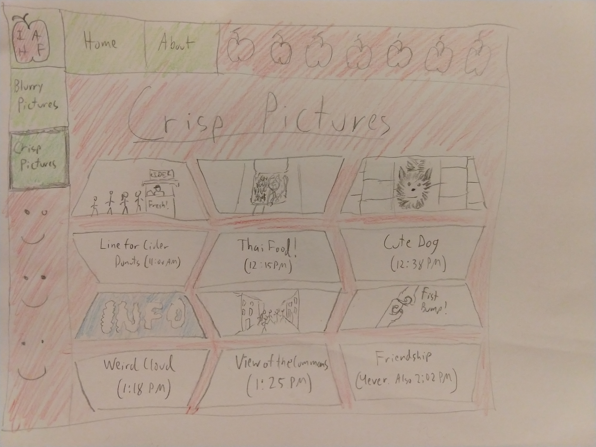
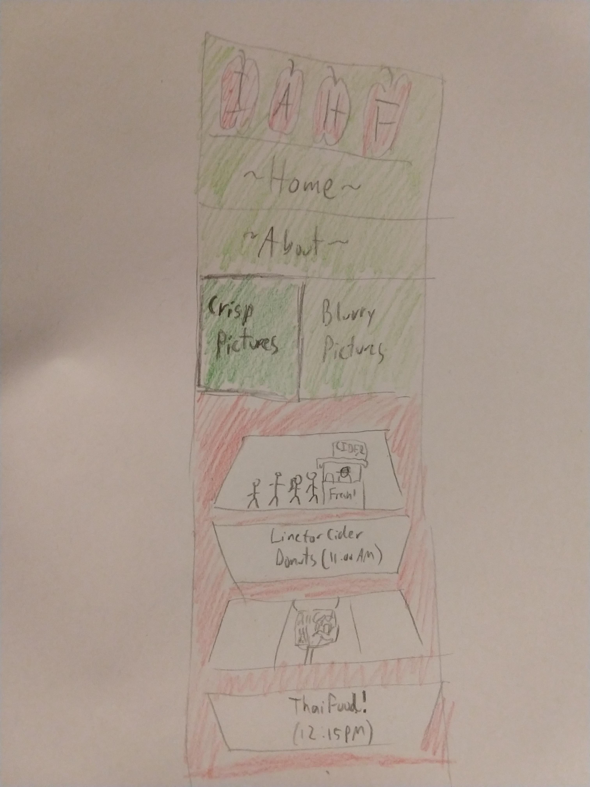

# Project 2 - Design Journey

**For each milestone, complete only the sections that are labeled with that milestone.**

Be clear and concise in your writing. Bullets points are acceptable.

## Milestone 1

### Target Audience (Milestone 1)
[In this part, write down who your target audience is.]

> Example: My target audience is Chinese parents who are visiting their children (college students) at Cornell in the fall. They may not be proficient in English, but they understand basic daily conversations, like greetings. They are not familiar with Ithaca, but they are interested in learning more about it.

### Persona (Milestone 1)
[In this part, create a persona that can represent your target audience, and describe him or her in details below.]

> Example: Ke Zhang, a 56-year-old Chinese business man, is going to visit his daughter Fan Zhang in Cornell. This is his first time visiting the United States. He is nervous but excited. For this trip, Ke is practicing English at home. Although not yet proficient, his English is good enough for simple greetings or asking directions.

> Ke operates his own furniture firm in China. He is a hard-working business man who tries to maximize the profit for his company. He is very excited about the trip to Ithaca, as it will allow him to spend time with his wife and daughter. In his spare time he reads books and listens to classical music.

### Needs (Milestone 1)
[Collect your target audience's needs and wants for the website and list them one by one. Come up with several appropriate design ideas on how those needs may be met. In the **Memo** field, justify your ideas and add any additional comments you have. There is no specific number of needs required for this, but you need enough to do the job. See the example design journey for an example of how you might do this.]

**EXAMPLE:**
- Need/Want #1
  - **Needs and Wants** (What does your client and audience need and want?)
    - Wants to visit Ithaca Apple Harvest Festival, but does not understand the English-language site.
  - **Design Ideas and Choices** (How will you meet those needs and wants?)
    - Because the target audience does not speak English, I will design the site in Chinese.
  - **Memo** (Justify your decisions; additional notes.)
    - Question for the TAs: am I allowed to make the website in Chinese?
- Need/Want #2
  - **Needs and Wants** (What does your client and audience need and want?)
    - Needs reading glasses to read.
  - **Design Ideas and Choices** (How will you meet those needs and wants?)
    -  Use large font for the text so older people can read the site easily.
  - **Memo** (Justify your decisions; additional notes.)
    - Using large font will make it easier for the audience to read.
- Need/Want #3
  - **Needs and Wants** (What does your client and audience need and want?)
    - Likes to create precise schedules for his days.
  - **Design Ideas and Choices** (How will you meet those needs and wants?)
    - Include a page with every event and a time for these events.
  - **Memo** (Justify your decisions; additional notes.)
    - Question for the TAs: if I make one page with a calendar view of events and one page with a list of events, is that 1 or 2 pages?

> Note (Q & A):
> Q: How many needs do you have to write?
> A: It depends on how many needs you identify. There is not a specific number for how many needs you have to write in the design journey map.

### Sketches / Screenshots / Storyboards (Milestone 1)
[In this part, include the sketches for each of your pages (both desktop and mobile versions). These sketches **must** be done on paper.]

> Note: You should have at least 8 sketches: a desktop and mobile sketch for each of your (at least) four pages. We have included two to give you an idea of what we are looking for in terms of sketches. To make sure that you don't have to worry about creating a design that is too similar to the example, these sketches have intentionally horrible information architecture and layout. They should be taken as examples of sketching ONLY, not as an example of good design.
> Additional Note: Make sure your sketches match your design choices and ideas from above. Given our example notes above, these sketches *should* be in Chinese, but the TA who made them doesn't speak Mandarin or Cantonese so the sketches are in English.

### Additional Design Justifications (Milestone 1)
[If you feel like you haven’t fully explained your design choices, or you want to explain some functions in your site (e.g., if you feel like you make a special design choice which might not meet P2M1 requirement), you can use the additional design justifications to justify your design choices. Remember, this is place for you to justify your design choices which you haven’t covered in Milestone 1. Use it wisely. However, you don’t need to fill out this section if you think all design choices have been well explained in the design journey for Milestone 1.]

> Example: I made the current year a big part of the design because I want to make sure that people who visit this version of the website in the future won't be confused about what year the website is for.

---

## Milestone 2

### Task Planning (Milestone 2)
[Plan out your four tasks for Milestone 2 here before doing your user testing]

1. Example: You arrive at the festival at about noon, feeling hungry. You decide to look at the Ithaca harvest festival website to help you figure out what kind of food is available and where to find it.

2. Example: As you are walking around the festival, you hear music being played. You are not sure who the band is (the English signs don't help) so you open the website to find out about the band.

3. (etc)

4.

### User 1 (Milestone 2)
[In this part, describe your user 1 by answering the questions below.]

1. Who is your user 1, e.g., where user 1 comes from, what is your user 1’s job, characteristics, etc.?

> Example: User 1 is a retired primary school teacher from China. She is a 58 year old lady, likes shopping and goes to dim sum every weekend. She used to teach mathematics to elementary school students. She was an outgoing and friendly teacher, always willing to help others. She keeps close relationships with all her students, even after they graduated from elementary school. Every year, her students visit her, which makes her happy and proud. She has a son who is now studying at Cornell, and she plans to visit him in the fall.

2. Does your user 1 belong to your target audience of the site? (Yes / No)

> Example: Yes.

[If “No”, what’s your strategy of associating the user test results to your target audience’s needs and wants? How can your re-design choices based on the user tests make a better fit for the target audience?]

### Tasks for User 1 (Milestone 2)
[Report the results for your user's performance on each of your four tasks. You should **describe the task** you ask the user to complete, explain **what the user did**, describe the user's **reaction/feedback** to the design, **reflect on the user's performance**, determine what **re-design choices** you will make. You can also add any additional comments in the **memo** field. See the example design journey for an example of what this would look like.]

**EXAMPLE:**
- Task #1
  - **Task Description** (What was the task for this user?)
    - You arrive at the festival at about noon, feeling hungry. You decide to look at the Ithaca harvest festival website to help you figure out what kind of food is available and where to find it.
  - **How did the user do? Did that meet your expectation?**
    - It only took the user a short time (around 30 seconds or so) to find the list of vendors, including which ones had food. This was about the amount of time I expected.
  - **User’s reaction / feedback to the design** (e.g., specific problems or issues found in the tasks)
    - She wanted to know more about the specific vendors, like what specific kind of food they are serving.
  - **Your reflections about the user’s performance to the task**
    - I am glad that the user was able to complete the task, but it makes a lot of sense that the user would want to know what specific food each vendor was serving.
  - **Re-design choices**
    - For each vendor, I will add a link to that vendor's website so that my users can click the link to learn more about the vendors.
  - **Memo** (Justify your decisions; additional notes.)
    - N/A
- Task #2
  - **Task Description** (What was the task for this user?)
    - As you are walking around the festival, you hear music being played. You are not sure who the band is (the English signs don't help) so you open the website to find out about the band.
  - **How did the user do? Did that meet your expectation?**
    - The user did not find the information, which did not meet my expectation.
  - **User’s reaction / feedback to the design** (e.g., specific problems or issues found in the tasks)
    - I thought it made sense to include all of the events at the bottom of the main page, but my user was looking for an "Events" page and couldn't find it after looking for two minutes. She was very frustrated when she couldn't find it.
  - **Your reflections about the user’s performance to the task**
    - Since my user wasn't able to complete this task, I definitely need to make changes to the design.
  - **Re-design choices**
    - I am going to add a large note at the top of the main page that roughly translates to "The list of events is at the bottom of this page."
  - **Memo** (Justify your decisions; additional notes.)
    - The user was expecting an events page, but I really think that the events are important and should go at the bottom of the front page. For that reason I'm going to make the change discussed above and see if it works for my later user tests.
- Task #3
- Task #4

**NOTE: The remainder of the sections for Milestone 2 and the Final Project have the same format as one of the examples provided above, so we omit them.**
